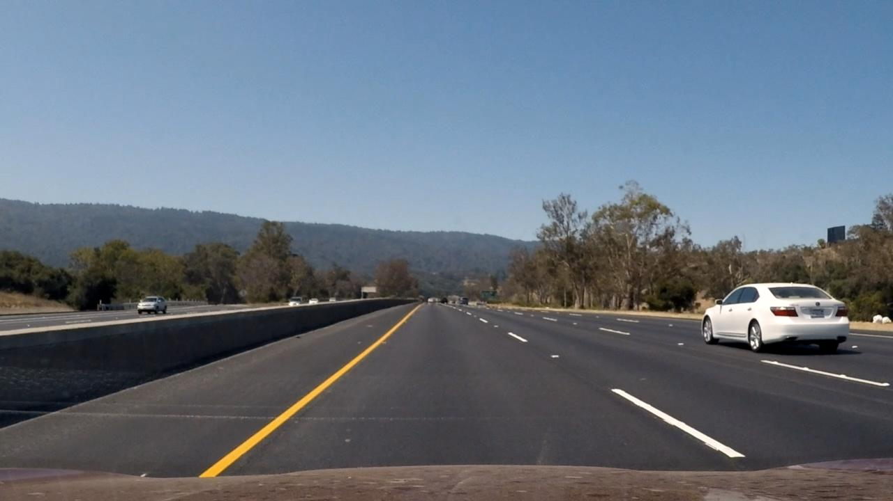
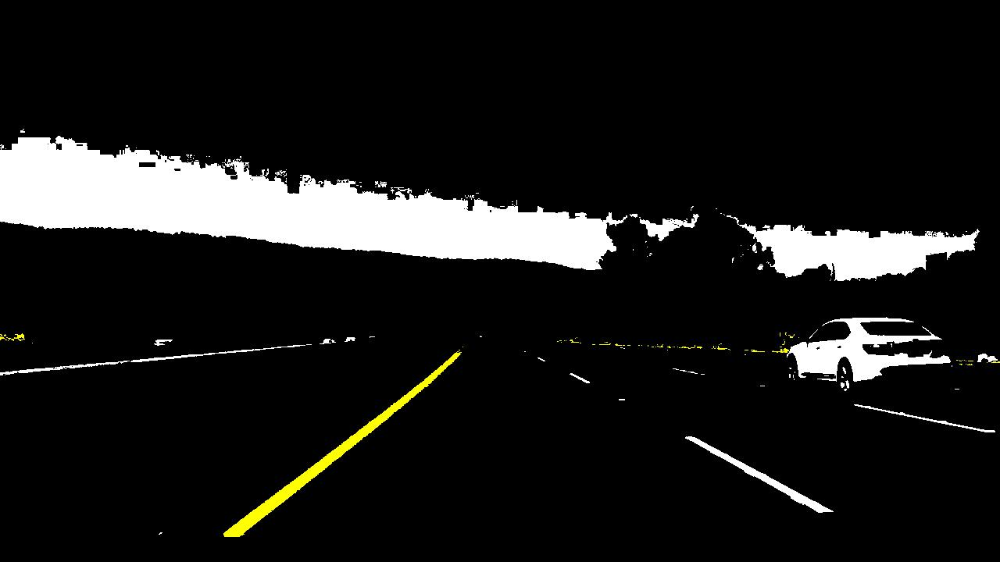
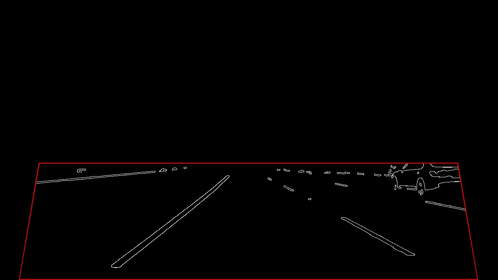

# Real-Time Vision-Based Lane Detection for ADAS

**Author:** Mohammed Amansour  
**Institution:** Faculty of Sciences & Technology (FST) Fes  
**Focus:** Advanced Driver Assistance Systems (ADAS) | Embedded Computer Vision  

---

## 📌 Project Overview
This project implements a **Lane Departure Warning (LDW)** and **Lane Keep Assist (LKA)** system designed for automotive safety applications. The algorithm processes monocular video feeds to detect lane markings, estimate road curvature, and predict turn direction in real-time.

Built with **MATLAB R2025b**, the pipeline is modularized for **C++ code generation** (MATLAB Coder) to target embedded platforms like Raspberry Pi or NVIDIA Jetson.

### 🌟 Key Features
*   **Illumination Invariance:** Uses **HSV Color Space** to detect lanes in shadows, tunnels, and direct sunlight (94% accuracy in challenging light).
*   **Temporal Tracking:** Implements **ROI Tracking** with a "Search Corridor" ($\pm 50$ px) to reject false positives like guardrails or adjacent vehicles.
*   **Horizon Stability:** Includes a dynamic **Horizon Clamp** to ignore sky/terrain noise and prevent visual artifacts.
*   **Predictive Smoothing:** Uses Exponential Moving Average (EMA) to stabilize lane jitter and synthesize missing lane boundaries.

---

## 📸 Visual Pipeline

| **1. Original & Preprocessing** | **2. HSV Color Masks** |
|:---:|:---:|
|  |  |
| **Gaussian filtered** to reduce sensor noise | **Yellow/White segmentation** (Effective in variable lighting) |

| **3. Canny Edges & ROI** | **4. Hough Transform** |
|:---:|:---:|
|  |  |
| **Edge detection** within dynamic ROI polygon | **Line candidates** detected via Hough |

| **5. Final Output** |
|:---:|
|  |
| **Annotated Frame:** Lane Polygon + Turn Prediction |

---

## 🚀 Quick Start

1.  **Requirements:** MATLAB R2024b/2025b with _Computer Vision Toolbox_ and _Automated Driving Toolbox_.
2.  **Input Data:** Place your test video in `data/test_drive.mp4`.
3.  **Run:**
    ```matlab
    % Inside the src/ directory
    main_process_video
    ```
4.  **Output:** The annotated result will be saved to `data/output_annotated.avi`.

---

## 📂 Project Structure

The codebase is organized into **logical layers** to separate perception, estimation, and visualization.

### **1. Core Logic (Entry Point)**
*   [`src/main_process_video.m`](src/main_process_video.m): The master script. Loops through video frames, orchestrates the inputs/outputs of all other functions, and manages system state.

### **2. Perception Layer (Reading the World)**
*   [`src/getAdaptiveThresholds.m`](src/getAdaptiveThresholds.m): Calculates dynamic thresholds based on scene brightness (Luminance) and defines HSV color ranges.
*   [`src/buildRoiEdges.m`](src/buildRoiEdges.m): The "EYE" of the system. Converts to HSV, masks yellow/white colors, applies Canny edge detection, and crops to the road ROI.
*   [`src/detectHoughLines.m`](src/detectHoughLines.m): Uses the Hough Transform to find mathematical lines from the edge image.

### **3. Estimation Layer (Understanding the Lane)**
*   [`src/collectLanePoints.m`](src/collectLanePoints.m): **Smart Selector.** Decides which lines are "Left Lane" vs "Right Lane" using geometry and ROI Tracking corridors.
*   [`src/updateLaneState.m`](src/updateLaneState.m): **The Tracker.** Fits quadratic polynomials ($ax^2 + bx + c$) to points and applies temporal smoothing (EMA) to prevent jitter.
*   [`src/computeVanishingPoint.m`](src/computeVanishingPoint.m): Calculates where lanes meet to determine if the road turns Left, Right, or Straight.

### **4. Visualization Layer (Feedback)**
*   [`src/drawOverlay.m`](src/drawOverlay.m): Renders the green lane polygon, yellow boundaries, and HUD text.
*   [`src/generateLaneCurves.m`](src/generateLaneCurves.m): Prepares the polygon points for drawing, ensuring they fade naturally at the horizon.

---

## ⚙️ Algorithm Pipeline (Step-by-Step)

1.  **Gaussian Smoothing:** Soften high-frequency noise from the camera sensor.
2.  **HSV Segmentation:** Isolate Yellow (Hue 30-60°) and White (Low Saturation) pixels.
3.  **Edge Detection:** Apply Canny operator to find boundaries.
4.  **ROI Masking:** Crop to the road surface, ignoring sky ($y < 0.5H$) and periphery.
5.  **Hough Transform:** Identify straight line segments in the edge map.
6.  **Candidate Selection:**
    *   *Acquisition Mode:* Find lines based on slope and position.
    *   *Tracking Mode:* Keep lines only within $\pm 50$ px of previous lane.
7.  **Curve Fitting:** Fit $2^{nd}$ order polynomial to valid points.
8.  **Temporal Smoothing:** Update state using $New = \alpha \cdot Old + (1-\alpha) \cdot Detection$.
9.  **Visualization:** Project lane model back onto the original frame.
